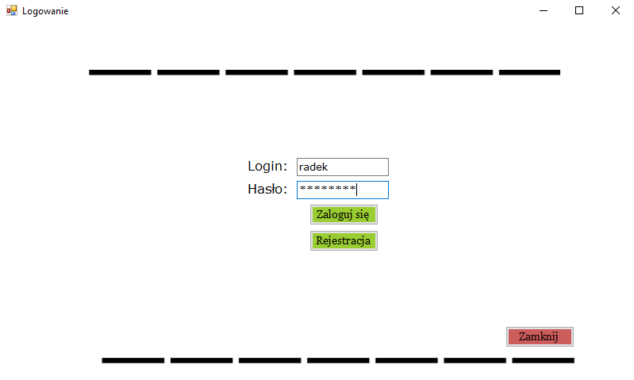
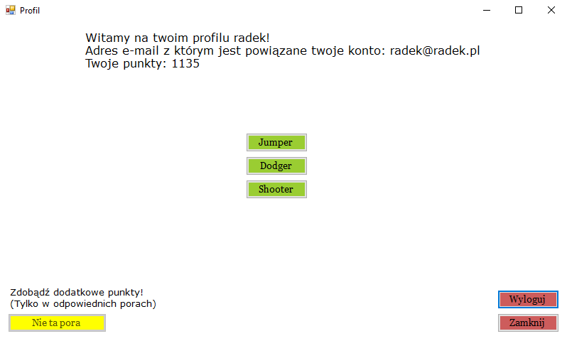

# ForFunApp
An application where you can create your account and log in to it and collect points in various ways. App creating for fun 
as part of the practice. Work still in progress...  
Here you can create new account, everything is saved to database (remember about valid login, e-mail and password). 
 
Here you can log in (if you put wrong login or password then you will not log in and will be displayed error message). 
 
When your login process is sucessfull then you are in your profile. 
  
Here you can see how many points you already have and your email address.  
You can choose the game you want to play and add bonus points. 
At the moment there are three options: Jumper, Dodger and Shooter. 
In Jumper, you need to go up as quickly as possible. 
In Dodger you have to dodge objects that fall from above. 
In Shooter you have to shoot the monsters that are coming to you and score points. 
  
  

